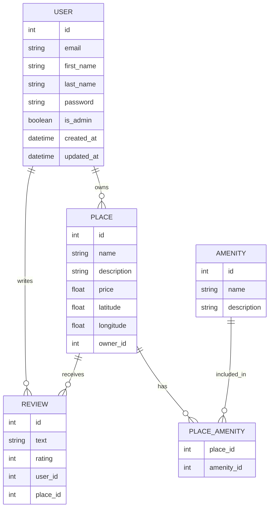

## HBnB Database ER Diagram

```mermaid
erDiagram

USER {
    int id
    string email
    string first_name
    string last_name
    string password
    boolean is_admin
    datetime created_at
    datetime updated_at
}

PLACE {
    int id
    string name
    string description
    float price
    float latitude
    float longitude
    int owner_id
}

REVIEW {
    int id
    string text
    int rating
    int user_id
    int place_id
}

AMENITY {
    int id
    string name
    string description
}

PLACE_AMENITY {
    int place_id
    int amenity_id
}

USER ||--o{ PLACE : owns
USER ||--o{ REVIEW : writes
PLACE ||--o{ REVIEW : receives
PLACE ||--o{ PLACE_AMENITY : has
AMENITY ||--o{ PLACE_AMENITY : included_in
```
