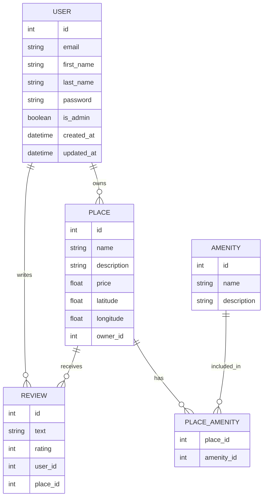

## HBnB Database ER Diagram


## Docker (quick start)

To build and run the API (part3) and the frontend static site (part4) using Docker and docker-compose:

1. Build and start containers:

```bash
docker-compose build --pull
docker-compose up -d
```

2. Open the frontend at: http://localhost:8080
    - The API will be available at: http://localhost:5002

3. Stop and remove containers:

```bash
docker-compose down --volumes
```

Notes:
- The API `Dockerfile` installs dependencies from `part3/requirements.txt`. If a pinned dependency fails during build (for example an unavailable exact version of `Flask-CORS`), the Dockerfile also installs a compatible `flask-cors` afterwards.
- If you prefer to run only the API locally (no Docker), continue using your virtualenv.

Production notes:
- The `part3/Dockerfile` now runs the API under `gunicorn` (non-root user) and exposes `/health` for container healthchecks.
- To build production images and run:

```bash
docker-compose build --pull
docker-compose up -d
docker-compose ps
```

To view API logs:

```bash
docker-compose logs -f api
```
